<h1 style="color:#409EFF;text-align:center;">基于VHDL的6位简易处理器的设计与实现</h1>

传送门：

- 本项目地址：[Gitee](https://gitee.com/snwjas/de2-6bit-cpu) | [GitHub](https://github.com/snwjas/DE2-6bit-CPU)
- 其他相关项目
  - DE2-VHDL计时器：[Gitee](https://gitee.com/snwjas/de2-electric-timer) | [GitHub](https://github.com/snwjas/DE2-Electric-Timer)
  - DE2-VHDL实验：[Gitee](https://gitee.com/snwjas/de2-labs) | [GitHub](https://github.com/snwjas/DE2-Labs)

## 前言

该设计是笔者大二时的硬件课实践作品，如今2年过去了，计算机基础和逻辑电路的知识已经忘得七七八八了，借着刚毕业还有点空闲时间，简单整理一下大学期间做过的东西，以记录自己的学习过程，也是对曾经不重视整理、总结和分享的自己的弥补和再激励。

## 设计概述

本设计为一个简易处理器，数据处理宽度为6位，ALU实现了8种运算：算术加、算术减、逻辑与、逻辑或、逻辑非、逻辑与非、逻辑与或和逻辑异或。

本设计使用`VHDL`语言开发，开发与仿真 IDE 为`Quartus II 9.0`，在`DE2-115开发板`上测试运行。

## 设计内容

1、本设计为一个简易处理器，数据处理宽度为6位，ALU实现了8种运算：算术加、算术减、逻辑与、逻辑或、逻辑非、逻辑与非、逻辑与或和逻辑异或。

2、本处理器采用有符号位运算，高两位为符号位，低四位为数据位，可表示数据宽度为-15 ~ 15，溢出标志位OF可表示正溢、正数、负溢、负数。

3、本处理器输入脉冲为27MHZ晶振脉冲作脉冲源的四节拍顺序脉冲，每按一次按键产生四个顺序脉冲，每个脉冲持续高电平为27MHZ的一个周期。

4、进行运算时由七段显示管辅显，可显示四种标志位∪：正溢 与 ∩：负溢。

5、本处理器可以记录上一次计算结果并进行再运算。

## 设计说明

本处理器由12个模块组成，包括：

1、一个时序发生器，用于产生一个四节拍的顺序脉冲。

2、一个指令寄存器，13位，接收一个3位的操作码，和两个5位的操作数。

3、一个6位3选2多路复用数据选择器，用于从输入的两个操作数和上一次运算结果中选择两个操作数进行下一次运算。

4、一个6位寄存器A，用于暂存操作数A。

5、一个6位寄存器B，用于暂存操作数B。

6、一个ALU，核心部件，用于进行8种运算。

7、一个4位数据缓存寄存器，用于暂存ALU运算结果。

8、一个2位状态字寄存器，用于暂存ALU运算所产生的状态，如正负数，溢出。

9、一个用于显示状态字的七段显示译码器。

10、三个用于显示输入输出的七段显示译码器，其输入为四位BCD码，输出位高低两位十进制数。

## 指令描述

ALU的八种预算指令如下：

| **指令** | **操作** | **说明**           |
| -------- | -------- | ------------------ |
| 000      | 算术加   | $Y=A+B$            |
| 001      | 算术减   | $Y=A-B$            |
| 010      | 逻辑与   | $Y=AB$             |
| 011      | 逻辑或   | $Y=A+B$            |
| 100      | 逻辑非   | $Y=\overline{A}$   |
| 101      | 逻辑与非 | $Y=\overline{AB}$  |
| 110      | 逻辑与或 | $Y=\overline{A+B}$ |
| 111      | 逻辑异或 | $Y=A \bigoplus B$  |

## 顶层设计

设计逻辑图：

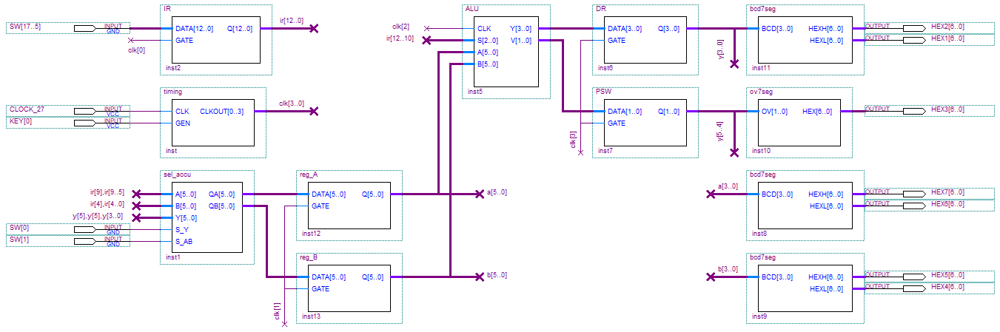

设计说明：

1、开关SW[17..5]为输入的操作码和操作数，SW[17..15]为操作码，SW[14..10]为操作数A，SW[9..5]为操作数B。输入时，两个操作数为5位，最高位为符号位，作运算时复用SW[14]和SW[9]作两位符号位。

2、KEY[0]为四节拍顺序脉冲发生按键，按一下产生一个四节顺序拍脉冲。

3、开关SW[0]和SW[1]为操作数选择开关，SW[0]为低电平时，选择AB；SW[0]为高电平且SW[1]为低电平时，选择YB；SW[0]为高电平且SW[1]为高电平时，选择YA。

## 模块设计

1、四节拍顺序脉冲发生器

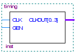

2、6位三选二多路数据选择器

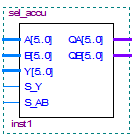

3、指令寄存器

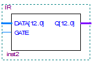

4、ALU（算术逻辑运算单元）

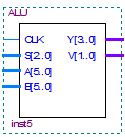

5、7段显示译码器

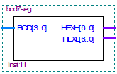

6、显示状态字的7段显示译码器

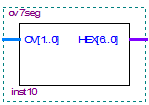

## 设计仿真

1、四节拍顺序脉冲发生器

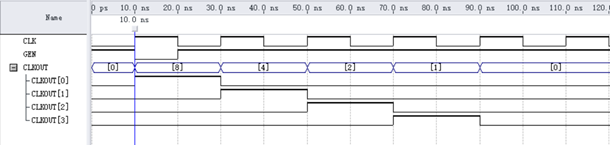

因为DE2板上的按键在松开时的状态是高电平，按下时状态是低电平，故由GEN = '0' AND GEN'LAST_VALUE = '1' 判断按键按下。由波形图可以看出，按键按下，然后顺序产生了四个脉冲。四节拍顺序脉冲发生器功能是正常的。

2、6位3选二多路复用数据选择器

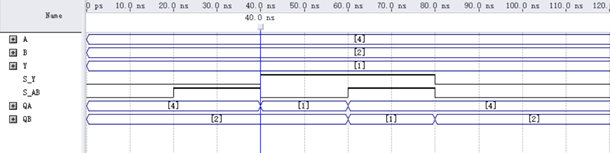

可以看出S_Y=’0’时，选择A、B作为QA、QB输出；S_Y=’0’ AND S_AB=’0’时，选择Y、B作为QA、QB输出；S_Y=’0’ AND S_AB=’1’时，选择A、Y作为QA、QB输出。6位3选二多路复用数据选择器功能正常。

3、ALU（算术逻辑运算单元）

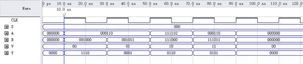

这里只进行了四种加法运算，分别是6+8，6+11，-6-11，6-8。从波形图可以看出：

6+8 运算结果Y为14，V为”00”为正数，运算正确。

6+11 运算结果Y为1，V为”01”为正溢，运算正确。

-14-8 运算结果Y为6，V为”10”为负溢，运算正确。

6-11 运算结果Y为5，V为”11”为负数，运算正确。

## 总结

本设计总共是有两个版本的，本文中描述的是第一个版本，至于第二个版本，设计和功能上可能是复杂一点的，但它是为了解决什么问题而做的，我已经忘了，现在也看不懂了，这里贴一下它的设计图：

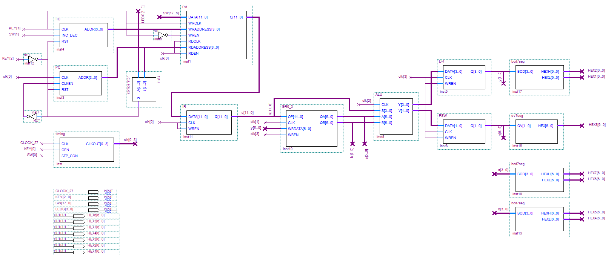

另外，还有本设计中存在的一个Bug至今仍然记忆尤新，它是这样的，如果使用上一次的运算结果再运算，一按键输入就会跳到别的数字去（如，上一次运算结果是5，我调用上一次结果时，可能会变成其他数字），造成无法再运算，我一开始以为是电路延时什么的问题，困扰了我很久，后来我了解到应该是一个`按键抖动`的问题，我按键没有做消抖，所以切换时，高低电位连续跳动造成结果变成了其他数字。这个Bug在本设计中是没解决的。
